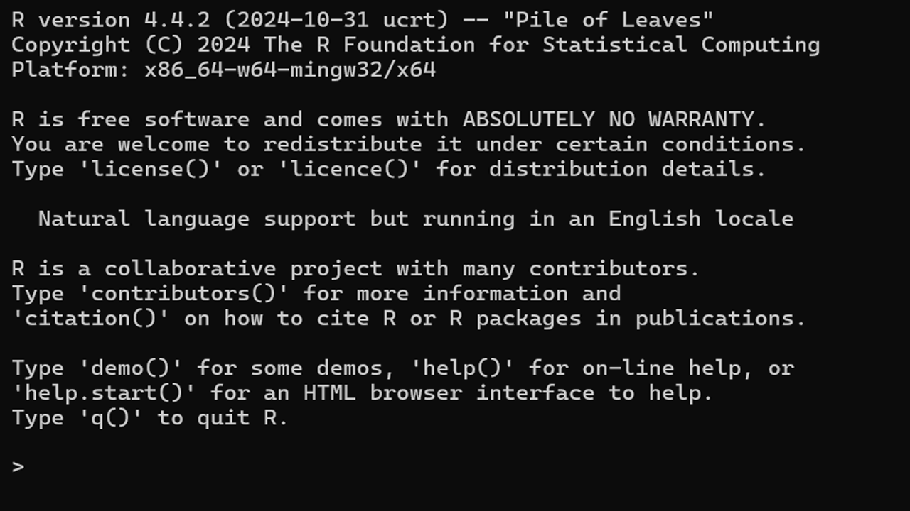

# 1. Install R, RStudio, and some R packages

- For your <strong>UHasselt laptop/PC</strong>, please install R/RStudio via the <strong>UHasselt Software Center</strong>. Open the link in a new tab by right Click <a href="../assets/UHasselt%20Software%20Center.pdf" target="_blank" rel="noopener noreferrer">installation instructions</a>.

**Important!** If you still **cannot** see the applications **CRAN R** and **RStudio** in the **UHasselt Software Center** after following the instructions, **please submit a ticket to the UHasselt Service Desk**.

- For your **personal laptop/PC** you can go to the official R/RStudio websites:


<https://cran.r-project.org/>

Download and install the correct version for your operating system:

- Windows
- macOS
- Linux

After installation, go to the R installation folder, for example: C:\Program Files\R\R-4.4.2\bin (Replace R-4.4.2 with the version of R installed on your computer). Then double-click the R application file to check that R opens and works correctly. 
When R opens, you should see the R version information on the first line.

<p align="center">
  
</p>


# 2. Install RStudio

RStudio is an editor that makes it easier to write and run R code.

Download a non-commercial RStudio Desktop from:

<https://posit.co/download/rstudio-desktop/>

Install it, then open RStudio.

When RStudio opens successfully, you should see four main panels:

1. Source panel
2. Console
3. Environment / History
4. Files / Plots / Packages / Help


# 3. Create an RStudio project

Open RStudio. 

Using an RStudio project is recommended because it keeps your working directory organized.

Then go to:

```text
File > Save workspace image to ~/.RData> New Directory > New Project> write r_tutorial at Directory name > click on Browse and choose a directory to save the R project
```

This creates an RStudio project in the directory you selected.

Every time you want to practice the tutorial sessions, go to the folder where you saved the `r_tutorial` project and double-click the `r_tutorial.Rproj` file. This will open the project in RStudio.

For each session of the R tutorial, you can create a new R script by clicking the first icon in the RStudio toolbar.

When you save the script, it will be stored in your `r_tutorial` project folder. You can open it again and revise it at any time.


# 5. Install and load R packages

R contains many built-in functions, but additional functions are available through packages.

A package normally needs to be installed only once on your computer.

Packages are usually loaded near the beginning of an R script.

To avoid reinstalling a package that is already installed, you can first check whether the package exists:


```r
if (!requireNamespace("ggplot2", quietly = TRUE)) {
  install.packages("ggplot2")
}

library(ggplot2)
```

This code means:

If ggplot2 is not installed, install it.
Then load ggplot2 so it can be used in the current R session.

This is useful because reinstalling packages again and again can take time and may sometimes cause installation or version conflicts.

So:

**install.packages()** installs a package on your computer and normally needs to be run only once.
**library()** loads an installed package into the current R session and needs to be run again when you restart R.
