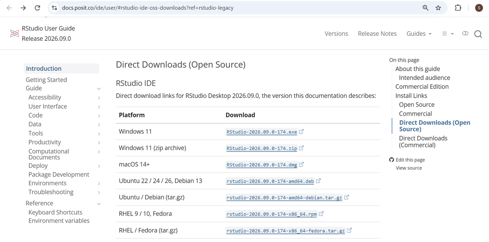

# 1. Install R, RStudio, and some R packages

- For your <strong>UHasselt laptop/PC</strong>, please install R/RStudio via the <strong>UHasselt Software Center</strong>. Open the link in a new tab by right Click <a href="../assets/UHasselt%20Software%20Center.pdf" target="_blank" rel="noopener noreferrer">installation instructions</a>.

**Important!** If you still **cannot** see the applications **CRAN R** and **RStudio** in the **UHasselt Software Center** after following the instructions, **please submit a ticket to the UHasselt Service Desk**.

- For your **personal laptop/PC** you can go to the official R/RStudio websites:


<https://cran.r-project.org/>

Download and install the correct version for your operating system:

- Windows
- macOS
- Linux

After installation, go to the R installation folder, for example: **C:\Program Files\R\R-4.4.2\bin** (Replace R-4.4.2 with the version of R installed on your computer). Then double-click the R application file to check that R opens and works correctly. 
When R opens, you should see the R version information on the first line.

<p align="center">
  
</p>


# 2. Install RStudio

RStudio is an editor that makes it easier to write and run R code.

Download the free, non-commercial version of RStudio Desktop from:

<https://posit.co/download/rstudio-desktop/>

Choose the installation link that matches your operating system.

<p align="center">
  
</p>


# 3. Create an RStudio project

After installation, open RStudio.

Using an RStudio project is recommended because it keeps your working directory organized.

For that, please take these steps:

```text
File > Save workspace image to ~/.RData> New Directory > New Project> write r_tutorial at Directory name > click on Browse and choose a directory to save the R project
```

This creates an RStudio project in the directory you selected.

Every time you want to practice the tutorial sessions, go to the folder where you saved the `r_tutorial` project and double-click the `r_tutorial.Rproj` file. This will open the project in RStudio.

For each session of the R tutorial, you can create a new R script by clicking the first icon in the RStudio toolbar.

When you save the script, it will be stored in your `r_tutorial` project folder. You can open it again and revise it at any time.


# 4. Install and load R packages

R contains many built-in functions, but additional functions are available through packages.

R packages are bundles of reusable R code and related materials that add capabilities to R.

A package can contain functions, datasets, documentation, and sometimes compiled code. Instead of writing everything yourself, you can install a package and use functions that someone else has already built and tested.

A package normally needs to be installed only once on your computer.

Packages are usually loaded near the beginning of an R script.

To avoid reinstalling a package that is already installed, you can first check whether the package exists:


```r
if (!requireNamespace("ggplot2", quietly = TRUE)) {
  install.packages("ggplot2")
}

library(ggplot2)
```

This code means:

If ggplot2 is not installed, install it. **quietly = TRUE** means “check for the package without printing unnecessary messages to the console, and suppresses the usual message/warning about the package not being available.”
Then load ggplot2 so it can be used in the current R session.

This is useful because reinstalling packages again and again can take time and may sometimes cause installation or version conflicts.

So:

**install.packages()** installs a package on your computer and normally needs to be run only once.

**library()** loads an installed package into the current R session and needs to be run again when you restart R.

-----

# **Further explanation about R packages sources:**

## **CRAN**

**CRAN** stands for **Comprehensive R Archive Network**. It is the main online collection of **R** packages.
Most general-purpose packages, such as `ggplot2`, `dplyr`, and `readr`, are installed from **CRAN**.

Example:

`install.packages("ggplot2")`

## **Bioconductor**

**Bioconductor** is another collection of R packages, but it focuses mainly on **bioinformatics** and **biological data analysis**.
It contains packages for tasks such as **RNA-seq analysis, genomics, gene expression analysis, and single-cell analysis**.

Examples of **Bioconductor** packages include `DESeq2`, `edgeR`, and `limma`.

## **BiocManager**

**BiocManager** is an R package that helps **R** install and manage packages from **Bioconductor**.
In other words, **Bioconductor** is the collection of bioinformatics packages, while **BiocManager** is the tool used to install them.

First, install **BiocManager** from **CRAN**:

`install.packages("BiocManager")`

Then use it to install a **Bioconductor** package:

`BiocManager::install("DESeq2")`

means:

**BiocManager** → the package name
`::` → “use a function from this package”
install → the function name

So you can read it as:

Use the install() function from the BiocManager package.

In R, `::` means “use something from a package without loading the whole package.”


So, to summerize the R package sources:

**CRAN** → where many general R packages come from


**Bioconductor** → where many bioinformatics R packages come from


**BiocManager** → the tool used to install Bioconductor packages


------

````md
# Updating R and RStudio and Troubleshooting Package Installation

Keeping **R** and **RStudio** up to date is important, but it can sometimes encounter problems after an update, especially with installed packages.

This section explains:

- the difference between updating R and RStudio
- what happens to your installed packages after updating R
- how to check R library paths
- what happens if you install the same package more than once
- what exit status `0` and non-zero exit status mean
- how to troubleshoot common package installation problems

---

## 1. R and RStudio are different programs

Although we normally use them together, **R and RStudio are not the same thing**.

- **R** is the programming language and statistical computing environment.
- **RStudio** is an Integrated Development Environment (IDE) that provides a convenient interface for working with R.

This means that **R and RStudio are updated separately**.

Updating RStudio does not automatically update R, and updating R does not automatically update RStudio.

You can check your current R version by running:

```r
R.version.string
```

For example:

```text
[1] "R version 4.x.x"
```

You can also see information about your current R session using:

```r
sessionInfo()
```

---

## 2. Updating R

When a new version of R is installed, the previous version may still remain on your computer.

For example, you may have previously used:

```text
R 4.4
```

and then install:

```text
R 4.5
```

The new R version may use a **different package library folder**.

This is important because your previously installed packages may still exist in the library folder associated with the older R version.

As a result, after updating R you may try:

```r
library(ggplot2)
```

and receive an error such as:

```text
there is no package called 'ggplot2'
```

This does not necessarily mean that `ggplot2` has disappeared from your computer.

It may simply be installed in the library folder used by your previous version of R.

---

## 3. What is an R library?

An **R library** is a folder where installed R packages are stored.

R can use more than one library folder.

To see the library paths currently used by R, run:

```r
.libPaths()
```

For example, on Windows you may see something similar to:

```text
[1] "C:/Users/username/AppData/Local/R/win-library/4.5"
[2] "C:/Program Files/R/R-4.5.1/library"
```

The first path is often your **personal package library**.

The second path is usually the library associated with the R installation itself.

---

## 4. Old and new library paths after updating R

Suppose your old version of R used:

```text
C:/Users/username/AppData/Local/R/win-library/4.4
```

After updating R, the new version may use:

```text
C:/Users/username/AppData/Local/R/win-library/4.5
```

Your old packages may still exist inside the `4.4` folder, while the new R version searches the `4.5` folder.

You can check the current library paths using:

```r
.libPaths()
```

You can also check where a specific package is installed:

```r
find.package("ggplot2")
```

For example:

```text
"C:/Users/username/AppData/Local/R/win-library/4.5/ggplot2"
```

To see installed packages together with their library locations, use:

```r
installed.packages()[, c("Package", "LibPath")]
```

---

## 5. What should I do with packages after updating R?

After a major R update, it is generally safer to **reinstall the packages you need using the new version of R**.

For CRAN packages:

```r
install.packages("ggplot2")
```

For example:

```r
install.packages("ggplot2")
install.packages("dplyr")
install.packages("readr")
```

For Bioconductor packages, use:

```r
BiocManager::install("DESeq2")
```

Reinstalling packages ensures that they are installed correctly for your current version of R.

---

## 6. Check which version of R RStudio is using

If multiple versions of R are installed on your computer, RStudio may sometimes use a different version than expected.

You can check the version currently being used inside RStudio with:

```r
R.version.string
```

You can also check:

```r
R.home()
```

This shows the location of the R installation currently being used.

If necessary, the R version used by RStudio can be changed through the RStudio settings.

---

# Package Installation

## 7. Installing and loading are different

A common source of confusion for beginners is the difference between **installing** and **loading** a package.

### Install a package

Installation usually needs to be done only once:

```r
install.packages("ggplot2")
```

This downloads the package and saves it in one of your R library folders.

### Load a package

Each time you start a new R session and want to use the package, load it with:

```r
library(ggplot2)
```

A simple way to remember this is:

> **Install once, load each new R session.**

---

## 8. What happens if I accidentally install a package twice?

Usually, nothing serious happens.

For example, suppose you already installed:

```r
install.packages("ggplot2")
```

and later accidentally run the same command again:

```r
install.packages("ggplot2")
```

R will normally reinstall or update the package in the same library location.

It does **not normally create two copies of the package in the same library**.

Afterwards, you can continue using the package normally:

```r
library(ggplot2)
```

Therefore, accidentally installing a package twice is usually not a problem.

---

## 9. Avoid unnecessary reinstallation

If you want R to install a package only when it is not already available, you can use:

```r
if (!requireNamespace("ggplot2", quietly = TRUE)) {
  install.packages("ggplot2")
}
```

This means:

> If `ggplot2` is not available, install it.

For a Bioconductor package:

```r
if (!requireNamespace("DESeq2", quietly = TRUE)) {
  BiocManager::install("DESeq2")
}
```

---

# Understanding Installation Messages

## 10. What does exit status 0 mean?

Some installation or external build processes may report an **exit code** or **exit status**.

An exit status tells you whether the process completed successfully.

An exit status of:

```text
0
```

normally means:

> The process completed successfully.

So:

```text
Process exited with code 0
```

is normally a success message, not an error.

For normal R package installation, you may also see:

```text
* DONE (package_name)
```

This also indicates that the package installation completed successfully.

---

## 11. What does a non-zero exit status mean?

A **non-zero exit status** means that something went wrong during the installation process.

For example:

```text
Warning:
installation of package 'examplePackage' had non-zero exit status
```

The important point is:

> The non-zero exit status is usually not the actual error. It only tells you that the installation failed.

The actual reason is normally shown **a few lines earlier in the Console**.

Therefore, when you see:

```text
non-zero exit status
```

scroll upward and look for the first message containing:

```text
ERROR:
```

That message usually explains the real problem.

---

# Common Package Installation Problems

## 12. Missing dependency

R packages often depend on other packages.

You may see an error such as:

```text
ERROR: dependency 'XYZ' is not available
```

This means that the package you are trying to install requires another package called `XYZ`.

Try installing the missing package first:

```r
install.packages("XYZ")
```

Then try installing your original package again.

If the missing dependency is a Bioconductor package, use:

```r
BiocManager::install("XYZ")
```

---

## 13. Package is not available for your R version

You may see:

```text
package 'XYZ' is not available for this version of R
```

First, check your R version:

```r
R.version.string
```

The package may require a newer version of R.

In this case, updating R may solve the problem.

---

## 14. Bioconductor version problems

Bioconductor packages are designed to work with particular versions of R and Bioconductor.

If you experience problems installing Bioconductor packages, check your Bioconductor installation with:

```r
BiocManager::valid()
```

This checks whether your installed packages are compatible with your current Bioconductor version.

You can also check your Bioconductor version:

```r
BiocManager::version()
```

To update Bioconductor packages when appropriate, use:

```r
BiocManager::install()
```

---

## 15. Package is currently in use

Sometimes R cannot replace a package because the package is currently loaded.

You may receive an error while trying to update or reinstall it.

A simple solution is:

1. Save your work.
2. Restart R or RStudio.
3. Do not load the package.
4. Try installing it again.

In RStudio, you can restart the R session and then run:

```r
install.packages("package_name")
```

For a Bioconductor package:

```r
BiocManager::install("package_name")
```

---

## 16. `00LOCK` errors

During installation, R may temporarily create a folder with a name such as:

```text
00LOCK
```

If an installation is interrupted, this folder may remain and prevent another installation.

You may see an error mentioning:

```text
00LOCK
```

First try:

1. Restart R/RStudio.
2. Run the installation again.

If the problem continues, inspect the library path using:

```r
.libPaths()
```

A leftover `00LOCK` folder may need to be removed from the affected library folder before trying the installation again.

Only remove the `00LOCK` folder associated with the failed installation, not your entire R library.

---

## 17. Library is not writable

You may see an error such as:

```text
library is not writable
```

This means that R is trying to install a package into a folder where you do not have permission to write files.

Check your library locations:

```r
.libPaths()
```

This issue can occur on university-managed or company-managed computers where users do not have administrator permissions.

A personal R library is normally preferable because you usually have permission to install packages there.

---

## 18. Download or internet problems

You may encounter messages such as:

```text
cannot open URL
```

or:

```text
download failed
```

Possible causes include:

- temporary internet problems
- firewall restrictions
- proxy settings
- temporary CRAN or Bioconductor server problems

First check your internet connection and try the installation again.

For example:

```r
install.packages("ggplot2")
```

---

## 19. Compilation or system dependency problems

Some R packages contain code written in languages such as:

- C
- C++
- Fortran

Other packages depend on external system libraries or software.

You may see errors mentioning:

```text
compilation failed
```

or:

```text
configuration failed
```

These problems are different from ordinary R package dependency problems.

The error message above the final non-zero exit status usually tells you which compiler, library, or system component is missing.

For beginners using university-managed computers, this may require help from the system administrator or university IT support.

---

# A Simple Troubleshooting Workflow

If a package does not install correctly, follow these steps.

## Step 1: Read the error message

Do not focus only on:

```text
non-zero exit status
```

Scroll upward in the Console and find the first:

```text
ERROR:
```

This is usually the most useful message.

---

## Step 2: Restart R

Save your work and restart R/RStudio.

Then try the installation again.

---

## Step 3: Check your R version

Run:

```r
R.version.string
```

Make sure your version of R is appropriate for the package you are trying to install.

---

## Step 4: Check your library paths

Run:

```r
.libPaths()
```

This tells you where R is currently looking for installed packages.

---

## Step 5: Check whether the package is already installed

For example:

```r
requireNamespace("ggplot2", quietly = TRUE)
```

If R returns:

```text
[1] TRUE
```

the package is installed and available.

You can also check where it is installed:

```r
find.package("ggplot2")
```

---

## Step 6: Try installing the package again

For a CRAN package:

```r
install.packages("ggplot2")
```

For a Bioconductor package:

```r
BiocManager::install("DESeq2")
```

---

## Step 7: Check Bioconductor if relevant

If the problem involves a Bioconductor package, run:

```r
BiocManager::valid()
```

and:

```r
BiocManager::version()
```

---

# Useful Commands to Remember

Check the R version:

```r
R.version.string
```

Check information about the current R session:

```r
sessionInfo()
```

Check where the current R installation is located:

```r
R.home()
```

Check library paths:

```r
.libPaths()
```

Check whether a package is installed:

```r
requireNamespace("ggplot2", quietly = TRUE)
```

Find where a package is installed:

```r
find.package("ggplot2")
```

Check the installed version of a package:

```r
packageVersion("ggplot2")
```

View installed packages and their library paths:

```r
installed.packages()[, c("Package", "LibPath")]
```

Check a Bioconductor installation:

```r
BiocManager::valid()
```

Check the Bioconductor version:

```r
BiocManager::version()
```

---

# Quick Summary

- **R and RStudio are separate programs** and are updated separately.
- Updating **R** may result in a new package library folder.
- Use `.libPaths()` to see where R currently stores and searches for packages.
- Packages installed for an older version of R may remain in the old library folder.
- After an R update, reinstalling the packages you need is generally the safest approach.
- Accidentally installing the same package twice is usually not a problem.
- **Exit status `0`** normally means that the process completed successfully.
- **Non-zero exit status** means that something went wrong.
- When you see a non-zero exit status, scroll upward and look for the first `ERROR:` message.
- Common causes include missing dependencies, incompatible R versions, library permissions, locked packages, `00LOCK` folders, internet problems, and missing system software.
- For Bioconductor problems, `BiocManager::valid()` is a useful diagnostic command.
````
