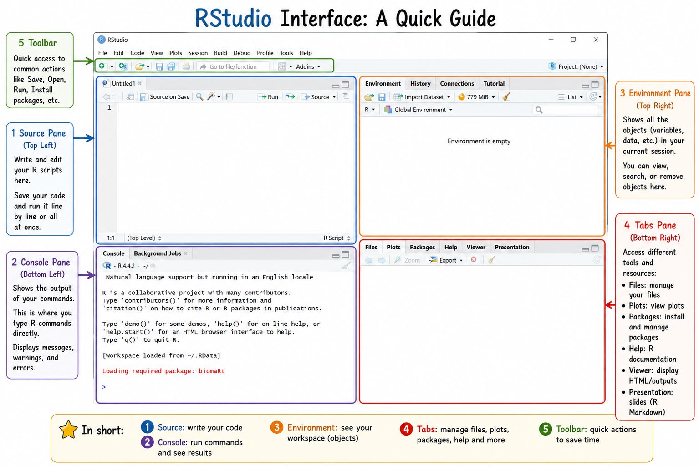
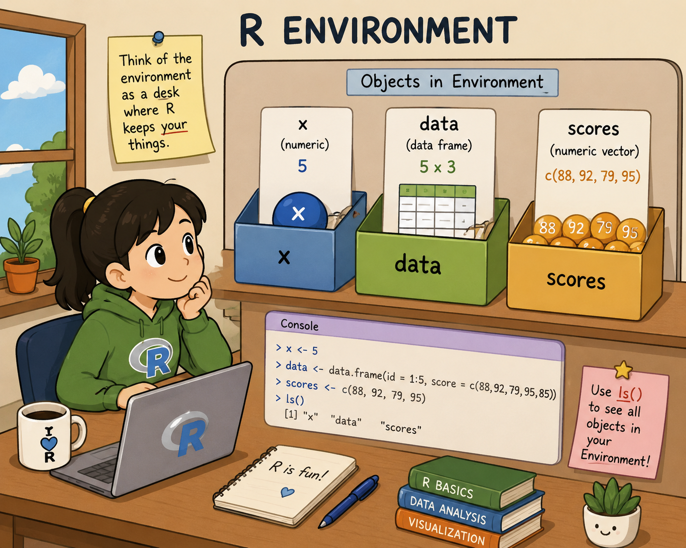

````markdown
# R Basics & Environment

## Introduction to RStudio

Before learning R programming, it is important to understand the **RStudio interface**.

RStudio is an integrated development environment (IDE) for R that helps you:

- write code
- run analyses
- visualize results
- manage files and packages

---

## The RStudio Interface

<p align="center">
  
</p>

<p align="center">
  <em>Overview of the main sections of the RStudio interface.</em>
</p>

---

## Main Parts of RStudio

### 1. Source Pane (Top Left)

The **Source Pane** is where you write and edit R scripts.

You can:

- save your code
- organize analyses
- run selected lines or entire scripts

Example:

```r
x <- 5
y <- 10

x + y
```

### Creating and running an R script

An R script is a file that contains R code and can be saved and reused later.

To create a new R script, go to:

```text
File > New File > R Script
```

To save the script:

```text
File > Save As
```

R scripts are saved with the `.R` extension.

For example:

```text
analysis.R
```

To run a line of code, place your cursor on that line and press:

```text
Ctrl + Enter
```

On macOS:

```text
Cmd + Enter
```

You can also select multiple lines and run them together using the **Run** button in the Source pane.

### Comments in R

Comments can be added to your code using `#`.

Anything written after `#` is ignored by R.

```r
x <- 5  # store the value 5 in x

# Calculate the square of x
x^2
```

Comments are useful for explaining what your code does and making your analysis easier to understand later.

#### Assignment and Comparison Operators in R

In R, `<-` is called the **assignment operator**. It is used to store a value inside an object.

```r
x <- 5
```

This means that the value `5` is assigned to the object `x`.

The `<-` operator is preferred in R because it clearly shows the direction of assignment: the value on the right is stored in the object on the left. It is also the traditional and most commonly used style in R scripts, tutorials, and package documentation.

The `=` operator can also be used for assignment:

```r
x = 5
```

However, in R, `=` is more commonly used inside functions to specify arguments.

```r
mean(x = glucose_values, na.rm = TRUE)
```

In this example, `x = glucose_values` tells the function which data to use, and `na.rm = TRUE` tells R to remove missing values before calculating the mean.

The `==` operator is used for comparison. It checks whether two values are equal and returns `TRUE` or `FALSE`.

```r
x <- 5

x == 5
```

Output:

```r
[1] TRUE
```

Another example:

```r
x == 10
```

Output:

```r
[1] FALSE
```

| Operator | Name | Use | Example |
|---|---|---|---|
| `<-` | Assignment operator | Stores a value in an object | `x <- 5` |
| `=` | Assignment or argument setting | Often used inside functions | `mean(x = values)` |
| `==` | Equality operator | Tests whether two values are equal | `x == 5` |

### Important rules for object names

R is **case-sensitive**.

This means that:

```r
age
Age
AGE
```

are considered three different objects.

Object names should not contain spaces.

Use names such as:

```r
gene_expression
sample_group
patient_age
```

instead of:

```text
gene expression
sample group
patient age
```

Numbers can be used in object names, but the name should not start with a number.

For example:

```r
sample1 <- 10
gene2 <- 5
```

Avoid using names that are already commonly used by R, such as:

```text
c
t
if
for
TRUE
FALSE
```

Using clear and descriptive object names makes your code easier to understand.

---

### 2. Console Pane (Bottom Left)

The **Console** is where R executes commands immediately.

You can:

- test small pieces of code
- see outputs
- view warnings and errors

Example:

```r
mean(c(1, 2, 3, 4, 5))
```

Output:

```r
[1] 3
```

The Console is useful for quickly testing commands, but code that you want to keep should normally be written in an R script.

You can use the **up arrow** on your keyboard to retrieve commands that you previously entered in the Console.

---

## Basic calculations in R

R can be used as a calculator.

```r
2 + 4
2 * 4
2 / 4
2^4
```

Some common mathematical functions are:

```r
sqrt(16)
log(10)
log10(10)
exp(1)
```

Here:

- `sqrt()` calculates the square root.
- `log()` calculates the natural logarithm.
- `log10()` calculates the logarithm with base 10.
- `exp()` calculates the exponential function.

For example, the mathematical constant \(e\) is not stored in R as an object called `e`.

Instead, use:

```r
exp(1)
```

---

## Functions in R

Most operations in R are performed using **functions**.

A function has a name followed by parentheses:

```r
mean()
```

Values supplied inside the parentheses are called **arguments**.

For example:

```r
mean(c(1, 2, 3, 4, 5))
```

The function `c()` combines values into a vector:

```r
c(1, 2, 3, 4, 5)
```

Other common functions include:

```r
sum(c(1, 2, 3, 4, 5))
round(3.14159, 2)
```

Output:

```r
[1] 15
[1] 3.14
```

Functions can perform many different tasks, including:

- mathematical calculations
- data manipulation
- statistical analyses
- creating plots
- importing datasets

---

## Getting help in R

If you do not know how a function works, you can use R's built-in help system.

For example:

```r
help("mean")
```

or:

```r
?mean
```

The documentation will appear in the **Help** tab in the bottom-right pane.

You can use this to check:

- what a function does
- which arguments it accepts
- examples of how to use it

---

### 3. Environment Pane (Top Right)

The **Environment Pane** stores all objects created during the current R session.

These objects may include:

- variables
- vectors
- data frames
- functions

* A variable is a named object that stores a value in R.
* A vector is a collection of values stored together in one object.


Think of the environment as a desk with labeled boxes holding your data and results.

<p align="center">
  
</p>

<p align="center">
  <em>The R environment stores objects such as x, data, and scores.</em>
</p>

---

## Creating Objects in R

You can create objects using the assignment operator `<-`.

```r
x <- 5

data <- data.frame(
  id = 1:3,
  score = c(88, 92, 79)
)

scores <- c(88, 92, 79, 95)
```

After running the code above, the objects will appear in your Environment pane.

---

## Viewing Objects in the Environment

To display all current objects:

```r
ls()
```

Example output:

```r
[1] "x" "data" "scores"
```

---

## Removing Objects

Remove a single object:

```r
rm(x)
```

Remove all objects:

```r
rm(list = ls())
```

---

## Checking Object Types

If you previously removed `x`, create it again before running the following example:

```r
x <- 5
```

You can use `class()` to check the class of an object:

```r
class(x)
class(data)
class(scores)
```

Expected output:

```r
[1] "numeric"
[1] "data.frame"
[1] "numeric"
```

Another useful function is `str()`, which shows the **structure** of an object.

```r
str(x)
str(data)
str(scores)
```

`str()` is especially useful for datasets because it shows the type of each variable and gives a quick overview of the data.

---

## Basic Data Types in R

R uses different **data types** to represent different kinds of information.

The main types that we will use are:

- **Numeric**: numbers
- **Character**: text
- **Logical**: `TRUE` or `FALSE`
- **Factor**: categorical data

### Numeric

Numeric values contain numbers.

```r
age <- 25
height <- 172.5

str(age)
str(height)
```

Numeric values can be used in calculations:

```r
age + 5
height / 100
```

### Character

Character values contain text and must be written between quotation marks.

```r
city <- "Hasselt"
gene <- "TP53"

str(city)
```

Text values can be combined using `paste()`:

```r
paste("Gene", "TP53")
```

Output:

```r
[1] "Gene TP53"
```

To combine text without adding a space:

```r
paste0("sample", 1)
```

Output:

```r
[1] "sample1"
```

### Logical

Logical values can only be:

```r
TRUE
FALSE
```

They are often produced by comparisons.

```r
5 > 3
```

Output:

```r
[1] TRUE
```

```r
5 == 10
```

Output:

```r
[1] FALSE
```

### Factor

Factors are used for **categorical variables**.

For example:

```r
group <- c("control", "treated", "control", "treated")

group_factor <- factor(group)

str(group_factor)
```

Factors store the possible categories as **levels**.

You can inspect these levels using:

```r
levels(group_factor)
```

---

## Comparison and Logical Operators

Comparison operators are often used to select observations that meet certain conditions.

| Operator | Meaning |
|---|---|
| `<` | Less than |
| `>` | Greater than |
| `<=` | Less than or equal to |
| `>=` | Greater than or equal to |
| `==` | Equal to |
| `!=` | Not equal to |

Examples:

```r
5 > 3
5 <= 10
5 == 5
5 != 10
```

Conditions can also be combined.

| Operator | Meaning |
|---|---|
| `&` | AND |
| `|` | OR |
| `!` | NOT |

For example:

```r
x <- 10

x > 5 & x < 15
```

Output:

```r
[1] TRUE
```

---

## Basic Data Structures in R

Data types describe the kind of values stored in R.

**Data structures** describe how these values are organized.

Common data structures include:

- vectors
- matrices
- lists
- data frames

### Vectors

A vector is a one-dimensional collection of values of the same basic type.

```r
scores <- c(88, 92, 79, 95)
```

You can also create sequences:

```r
1:10
```

or:

```r
seq(from = 0, to = 10, by = 2)
```

### Matrices

A matrix is a two-dimensional structure containing rows and columns.

All values in a matrix have the same basic type.

```r
my_matrix <- matrix(
  1:12,
  nrow = 3,
  byrow = TRUE
)

my_matrix
```

Output:

```r
     [,1] [,2] [,3] [,4]
[1,]    1    2    3    4
[2,]    5    6    7    8
[3,]    9   10   11   12
```

### Lists

A list can contain different types of objects.

```r
sample_info <- list(
  name = "sample_1",
  age = 25,
  scores = c(88, 92, 79)
)

sample_info
```

For example, the same list contains text, a numeric value, and a numeric vector.

### Data Frames

A data frame is a two-dimensional table containing rows and columns.

Different columns can contain different data types.

```r
patients <- data.frame(
  id = 1:3,
  group = c("control", "treated", "control"),
  age = c(25, 31, 28)
)

patients
```

Data frames are one of the most commonly used structures for data analysis in R.

We will work with them extensively in the next sessions.

---

## Indexing Objects

**Indexing** means selecting specific values from an object.

R uses square brackets `[ ]` for indexing.

### Indexing vectors

Create a vector:

```r
ages <- c(18, 25, 32, 41, 55)
```

Select the first element:

```r
ages[1]
```

Select the first three elements:

```r
ages[1:3]
```

Select specific elements:

```r
ages[c(1, 3, 5)]
```

Select everything except the first element:

```r
ages[-1]
```

You can also select values using a condition:

```r
ages[ages > 30]
```

Output:

```r
[1] 32 41 55
```

Multiple conditions can be combined:

```r
ages[ages > 20 & ages < 50]
```

Output:

```r
[1] 25 32 41
```

### Indexing matrices

For matrices, indexing follows the form:

```text
matrix[row, column]
```

For example:

```r
my_matrix[2, 3]
```

Select an entire row:

```r
my_matrix[1, ]
```

Select an entire column:

```r
my_matrix[, 2]
```

### Indexing data frames

Data frames also use:

```text
dataframe[row, column]
```

For example:

```r
patients[1, ]
```

Select the second column:

```r
patients[, 2]
```

A column can also be accessed using `$`:

```r
patients$age
```

You can use conditions to select rows:

```r
patients[patients$age > 25, ]
```

More advanced ways of filtering and selecting data will be covered in the next session.

---

### 4. Files, Plots, Packages, and Help Pane (Bottom Right)

This pane contains several useful tabs:

| Tab | Purpose |
|---|---|
| Files | Manage project files |
| Plots | Display graphs and visualizations |
| Packages | Install and load packages |
| Help | Access R documentation |
| Viewer | Display HTML outputs |

---

### 5. Toolbar

The toolbar provides quick access to common actions such as:

- creating new scripts
- saving files
- running code
- installing packages

---

## Why the Environment Matters

Understanding the R environment helps you:

- track your variables
- organize analyses
- avoid overwriting objects
- debug errors more easily

---

## Practice Exercise

Try the following:

1. Create an object called `temperature`.
2. Create a vector called `ages`.
3. Run `ls()` to display your objects.
4. Remove one object using `rm()`.
5. Check the class of your objects using `class()`.

```r
temperature <- data.frame(city = c('Hasselt', 'Genk', 'Leuven'), temp = c(21, 22, 19))
ages <- c(9,13,16, 18, 22, 35, 42, 55, 63, 82)
ls()
class(ages)
class(temperature)
```

---

## Additional Practice

Using the `ages` vector from the previous exercise:

1. Select the first three values.
2. Select all ages greater than 18.
3. Check which ages are greater than or equal to 35.
4. Create a character vector called `group` containing `"control"` and `"treated"`.
5. Convert `group` into a factor.
6. Use `str()` to inspect the factor.

```r
ages[1:3]

ages[ages > 18]

ages >= 35

group <- c("control", "treated", "control", "treated")

group <- factor(group)

str(group)
```

---

## Key Takeaways

- RStudio helps organize coding and analysis workflows.
- The Source pane is used to write scripts.
- The Console runs commands immediately.
- The Environment stores your objects.
- The bottom-right pane helps manage files, plots, and packages.
- R functions perform calculations and other operations.
- `help()` and `?` can be used to access R documentation.
- Common R data types include numeric, character, logical, and factor.
- Common data structures include vectors, matrices, lists, and data frames.
- Square brackets `[ ]` are used to select values from objects.
- Comparison and logical operators can be used to select data based on conditions.

Keeping your environment organized makes coding easier and more reproducible.
````
