# Data Visualization with ggplot2

## Learning Objectives

By the end of this tutorial, you will be able to:

- Understand the basic structure of a `ggplot2` plot
- Create scatter plots, bar plots, boxplots, violin plots, histograms, and line plots
- Customize plot labels, colors, themes, and legends
- Visualize biomedical-style datasets
- Create publication-ready plots
- Save plots as image files

---

# 1. Introduction to ggplot2

`ggplot2` is one of the most popular R packages for data visualization.

It is based on the **Grammar of Graphics**, which means that plots are built layer by layer.

A typical `ggplot2` plot has three main components:

```r
ggplot(data = dataset, aes(x = variable1, y = variable2)) +
  geom_function()
```

Where:

- `data` is the dataset
- `aes()` defines the aesthetic mapping
- `geom_*()` defines the type of plot

For example:

```r
ggplot(data = df, aes(x = group, y = expression)) +
  geom_boxplot()
```

---

# 2. Installing and Loading Required Packages

## 2.1 Install packages

You only need to install packages **one time** on your computer.

Do not reinstall packages every time you open RStudio. Reinstalling packages repeatedly can sometimes cause problems, especially if the package is already loaded or if R is using it during installation.

```r
install.packages("ggplot2")
install.packages("dplyr")
install.packages("tidyr")
install.packages("readr")
install.packages("patchwork")
```

---

## 2.2 Load packages

After installation, you only need to load the packages when starting a new R session.

```r
library(ggplot2)
library(dplyr)
library(tidyr)
library(readr)
library(patchwork)
```

---

# 3. Creating an Example Biomedical Dataset

In this tutorial, we will use a small simulated biomedical dataset.

The dataset contains gene expression values for different patients, treatment groups, and genes.

```r
set.seed(123)

expression_data <- data.frame(
  sample_id = paste0("S", sprintf("%02d", 1:60)),
  patient_id = paste0("P", sprintf("%02d", 1:60)),
  group = rep(c("Control", "Treatment"), each = 30),
  sex = sample(c("Male", "Female"), size = 60, replace = TRUE),
  age = round(rnorm(60, mean = 55, sd = 10)),
  gene_A = c(
    rnorm(30, mean = 6.2, sd = 0.7),
    rnorm(30, mean = 8.1, sd = 0.8)
  ),
  gene_B = c(
    rnorm(30, mean = 7.5, sd = 0.6),
    rnorm(30, mean = 7.2, sd = 0.7)
  ),
  gene_C = c(
    rnorm(30, mean = 5.8, sd = 0.9),
    rnorm(30, mean = 6.7, sd = 1.0)
  ),
  clinical_score = c(
    rnorm(30, mean = 40, sd = 8),
    rnorm(30, mean = 55, sd = 10)
  )
)

head(expression_data)
```

---

# 4. Understanding the Dataset

Before making plots, always inspect the dataset.

This helps us understand what the dataset contains before using it in `ggplot2`.  
We need to check the column names, data types, number of rows and columns, and whether the values look reasonable.

---

## 4.1 Check the Structure

The `str()` function shows the structure of the dataset.

It tells us the column names, data types, and a few example values.

```r
str(expression_data)
```

This helps us check that variables such as `gene_A` are numeric and variables such as `group` are categorical.

---

## 4.2 Check Summary Statistics

The `summary()` function gives a quick summary of each column.

```r
summary(expression_data)
```

For numeric columns, it shows the minimum, median, mean, and maximum values.  
It can also show missing values as `NA`.

---

## 4.3 Check Dataset Size

The `dim()` function shows the number of rows and columns.

```r
dim(expression_data)
```

For example, an output like `60 9` means the dataset has 60 rows and 9 columns.

---

## 4.4 Check Column Names

The `colnames()` function shows all column names.

```r
colnames(expression_data)
```

This is important because ggplot2 needs exact column names.  
For example, `group` and `Group` are different because R is case-sensitive.

---

## 4.5 Complete Code

```r
# View the structure of the dataset
str(expression_data)

# View summary statistics for each column
summary(expression_data)

# Check the number of rows and columns
dim(expression_data)

# Check the names of all columns
colnames(expression_data)
```

---

# 5. Basic ggplot2 Structure

The basic structure of a ggplot is:

```r
ggplot(data = expression_data, aes(x = group, y = gene_A)) +
  geom_boxplot()
```

This creates a boxplot of `gene_A` expression by group.

<p align="center">
  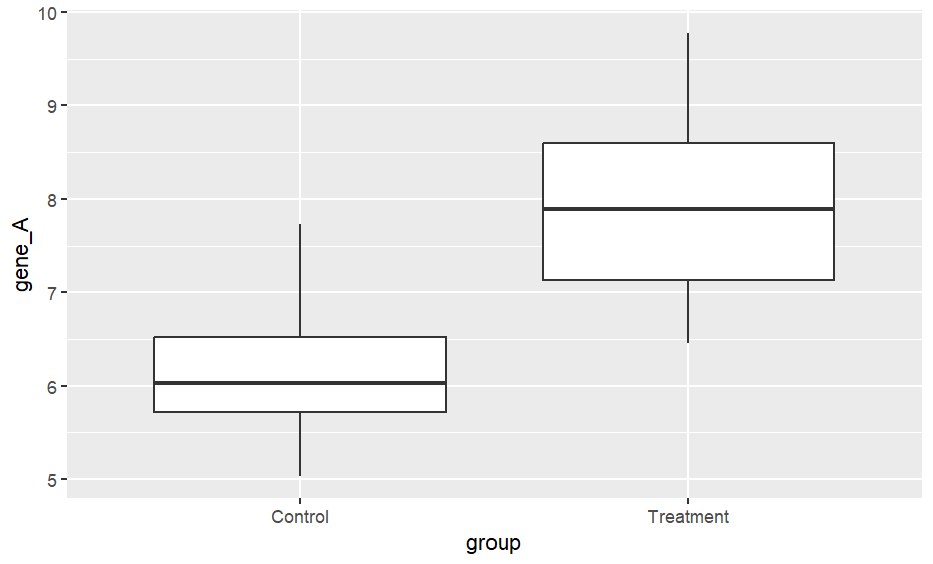
</p>

---

# 6. Scatter Plot

Scatter plots are useful for visualizing the relationship between two continuous variables.

Here, we visualize the relationship between `gene_A` expression and clinical score.

```r
ggplot(expression_data, aes(x = gene_A, y = clinical_score)) +
  geom_point()
```

---

## 6.1 Scatter Plot with Color Groups

We can color the points by treatment group.

```r
ggplot(expression_data, aes(x = gene_A, y = clinical_score, color = group)) +
  geom_point()
```

<p align="center">
  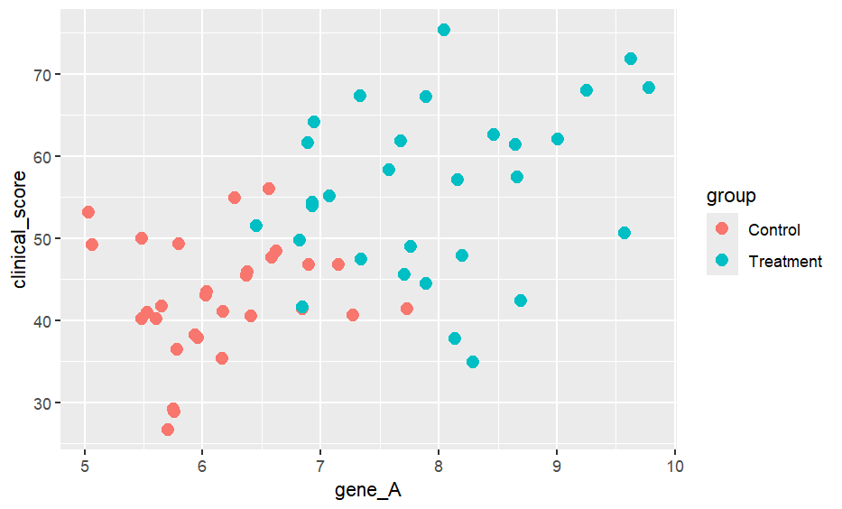
</p>

---

## 6.2 Scatter Plot with Larger Points

```r
ggplot(expression_data, aes(x = gene_A, y = clinical_score, color = group)) +
  geom_point(size = 4)
```

---

## 6.3 Scatter Plot with Regression Line

```r
ggplot(expression_data, aes(x = gene_A, y = clinical_score, color = group)) +
  geom_point(size = 3) +
  geom_smooth(method = "lm", se = TRUE)
```

<p align="center">
  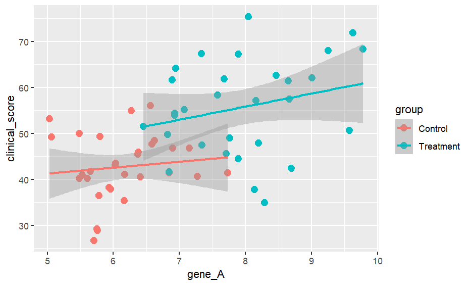
</p>

---

## 6.4 Scatter Plot with Labels

```r
ggplot(expression_data, aes(x = gene_A, y = clinical_score, color = group)) +
  geom_point(size = 3) +
  geom_smooth(method = "lm", se = TRUE) +
  labs(
    title = "Relationship Between Gene A Expression and Clinical Score",
    subtitle = "Comparison between control and treatment groups",
    x = "Gene A Expression",
    y = "Clinical Score",
    color = "Group"
  )
```

---

# 7. Boxplot

Boxplots are useful for comparing distributions between groups.

```r
ggplot(expression_data, aes(x = group, y = gene_A)) +
  geom_boxplot()
```

---

## 7.1 Boxplot with Colors

```r
ggplot(expression_data, aes(x = group, y = gene_A, fill = group)) +
  geom_boxplot()
```

---

## 7.2 Boxplot with Individual Data Points

Adding individual points helps show the actual data distribution.

```r
ggplot(expression_data, aes(x = group, y = gene_A, fill = group)) +
  geom_boxplot(alpha = 0.6) +
  geom_jitter(width = 0.15, size = 2)
```
<p align="center">
  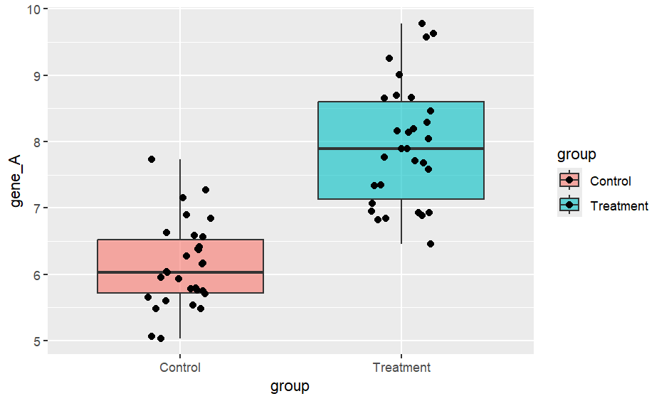
</p>


---

## 7.3 Publication-Style Boxplot

```r
ggplot(expression_data, aes(x = group, y = gene_A, fill = group)) +
  geom_boxplot(alpha = 0.7, outlier.shape = NA) +
  geom_jitter(width = 0.15, size = 2, alpha = 0.8) +
  labs(
    title = "Gene A Expression by Group",
    x = "Experimental Group",
    y = "Gene A Expression"
  ) +
  theme_classic()
```

---

# 8. Violin Plot

Violin plots show the distribution shape of the data.

```r
ggplot(expression_data, aes(x = group, y = gene_A, fill = group)) +
  geom_violin(alpha = 0.7)
```

---

## 8.1 Violin Plot with Boxplot

```r
ggplot(expression_data, aes(x = group, y = gene_A, fill = group)) +
  geom_violin(alpha = 0.6) +
  geom_boxplot(width = 0.15, outlier.shape = NA) +
  labs(
    title = "Gene A Expression Distribution",
    x = "Group",
    y = "Gene A Expression"
  ) +
  theme_minimal()
```

<p align="center">
  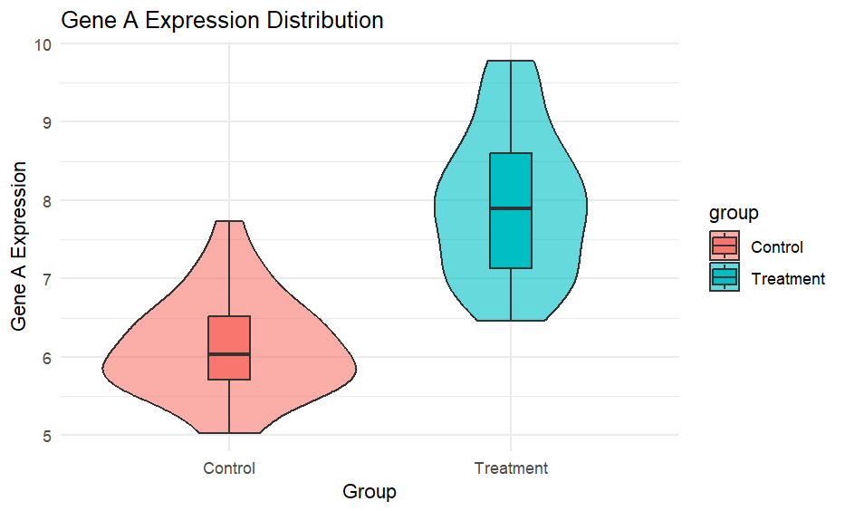
</p>

---

# 9. Bar Plot

Bar plots are useful for categorical summaries.

First, we calculate the average expression of `gene_A` in each group.

```r
gene_summary <- expression_data %>%
  group_by(group) %>%
  summarise(
    mean_gene_A = mean(gene_A),
    sd_gene_A = sd(gene_A),
    n = n(),
    se_gene_A = sd_gene_A / sqrt(n)
  )

gene_summary
```

---

## 9.1 Basic Bar Plot

```r
ggplot(gene_summary, aes(x = group, y = mean_gene_A)) +
  geom_col()
```

---

## 9.2 Bar Plot with Error Bars

```r
ggplot(gene_summary, aes(x = group, y = mean_gene_A, fill = group)) +
  geom_col(width = 0.6) +
  geom_errorbar(
    aes(
      ymin = mean_gene_A - se_gene_A,
      ymax = mean_gene_A + se_gene_A
    ),
    width = 0.2
  ) +
  labs(
    title = "Mean Gene A Expression by Group",
    x = "Group",
    y = "Mean Gene A Expression"
  ) +
  theme_classic()
```

<p align="center">
  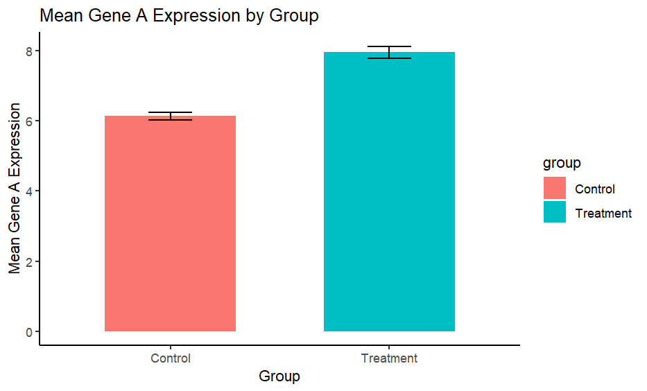
</p>

---

# 10. Histogram

Histograms show the distribution of a continuous variable.

```r
ggplot(expression_data, aes(x = gene_A)) +
  geom_histogram()
```

---

## 10.1 Histogram with Bin Width

```r
ggplot(expression_data, aes(x = gene_A)) +
  geom_histogram(binwidth = 0.5)
```

---

## 10.2 Histogram by Group

```r
ggplot(expression_data, aes(x = gene_A, fill = group)) +
  geom_histogram(binwidth = 0.5, alpha = 0.7, position = "identity")
```
<p align="center">
  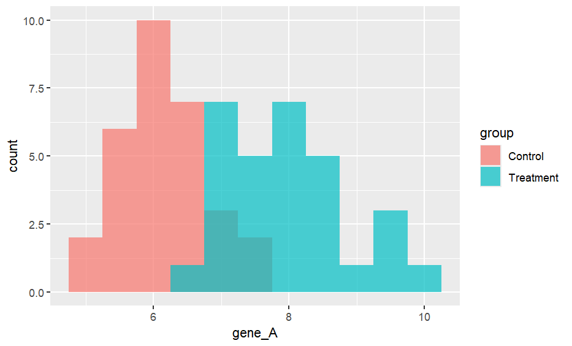
</p>

---

## 10.3 Histogram with Better Labels

```r
ggplot(expression_data, aes(x = gene_A, fill = group)) +
  geom_histogram(binwidth = 0.5, alpha = 0.6, position = "identity") +
  labs(
    title = "Distribution of Gene A Expression",
    x = "Gene A Expression",
    y = "Number of Samples",
    fill = "Group"
  ) +
  theme_minimal()
```

---

# 11. Density Plot

Density plots are smooth versions of histograms.

```r
ggplot(expression_data, aes(x = gene_A, fill = group)) +
  geom_density(alpha = 0.5)
```

---

```r
ggplot(expression_data, aes(x = gene_A, color = group, fill = group)) +
  geom_density(alpha = 0.3) +
  labs(
    title = "Density Plot of Gene A Expression",
    x = "Gene A Expression",
    y = "Density"
  ) +
  theme_classic()
```
<p align="center">
  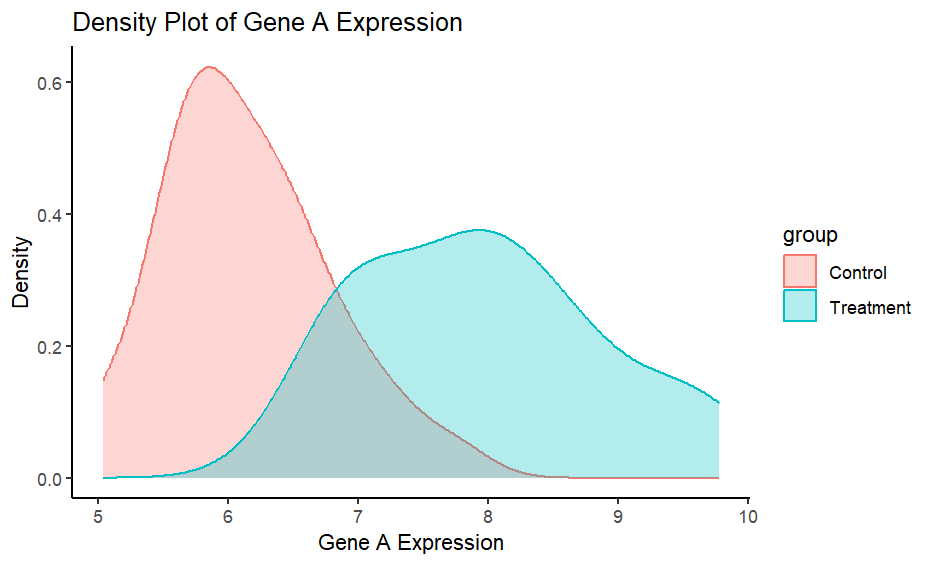
</p>

---

# 12. Line Plot

Line plots are useful for time-course data.

Let us create a simulated time-course gene expression dataset.

```r
time_course_data <- data.frame(
  time = rep(c(0, 6, 12, 24, 48), times = 2),
  group = rep(c("Control", "Treatment"), each = 5),
  gene_expression = c(
    5.1, 5.3, 5.4, 5.2, 5.1,
    5.0, 6.1, 7.2, 8.0, 8.4
  )
)

time_course_data
```

---

## 12.1 Basic Line Plot

```r
ggplot(time_course_data, aes(x = time, y = gene_expression)) +
  geom_line()
```

---

## 12.2 Line Plot by Group

```r
ggplot(time_course_data, aes(x = time, y = gene_expression, color = group)) +
  geom_line(size = 1.2) +
  geom_point(size = 3)
```

---

## 12.3 Line Plot with Labels

```r
ggplot(time_course_data, aes(x = time, y = gene_expression, color = group)) +
  geom_line(size = 1.2) +
  geom_point(size = 3) +
  labs(
    title = "Time-Course Gene Expression",
    subtitle = "Gene expression measured at multiple time points",
    x = "Time After Treatment, Hours",
    y = "Gene Expression",
    color = "Group"
  ) +
  theme_minimal()
```
<p align="center">
  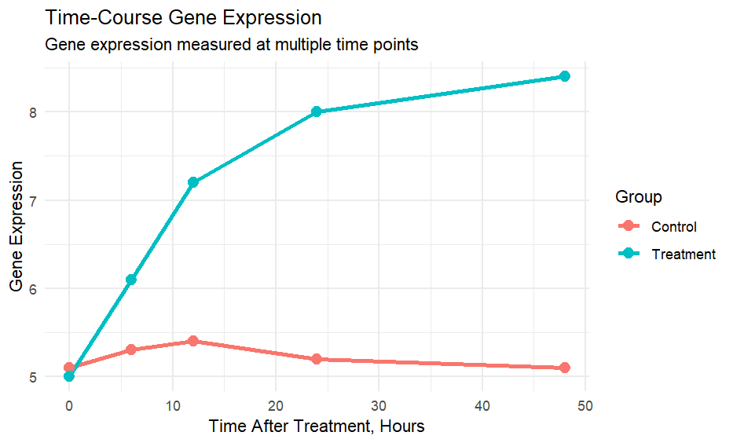
</p>

---

# 13. Reshaping Data for ggplot2

Many biomedical datasets contain several genes in separate columns.

For example:

```r
head(expression_data)
```

The genes `gene_A`, `gene_B`, and `gene_C` are currently stored in separate columns.

For many ggplot2 plots, it is better to reshape the data into long format.

---

## 13.1 Convert Wide Data to Long Data

```r
expression_long <- expression_data %>%
  pivot_longer(
    cols = c(gene_A, gene_B, gene_C),
    names_to = "gene",
    values_to = "expression"
  )

head(expression_long)
```

---

## 13.2 Compare Multiple Genes Using Boxplots

```r
ggplot(expression_long, aes(x = gene, y = expression, fill = group)) +
  geom_boxplot() +
  labs(
    title = "Expression of Multiple Genes by Group",
    x = "Gene",
    y = "Expression",
    fill = "Group"
  ) +
  theme_classic()
```
<p align="center">
  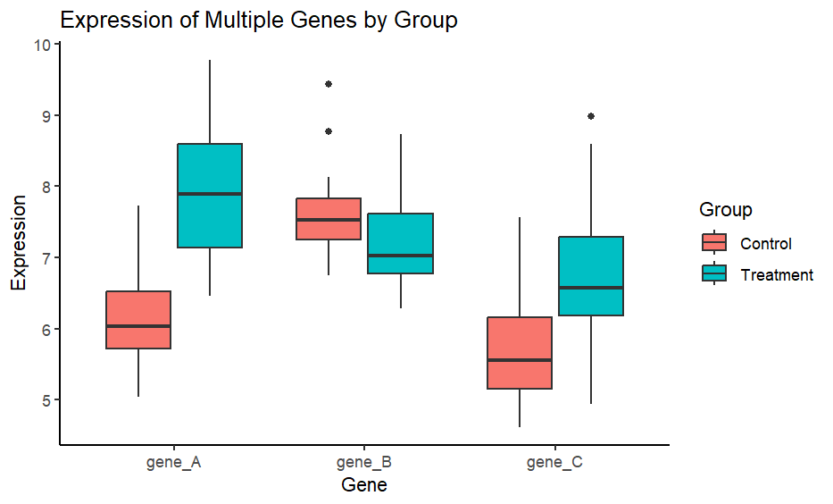
</p>

---

## 13.3 Faceted Boxplots

Facets allow us to create separate plots for each gene.

```r
ggplot(expression_long, aes(x = group, y = expression, fill = group)) +
  geom_boxplot() +
  facet_wrap(~ gene) +
  labs(
    title = "Gene Expression by Treatment Group",
    x = "Group",
    y = "Expression"
  ) +
  theme_bw()
```
<p align="center">
  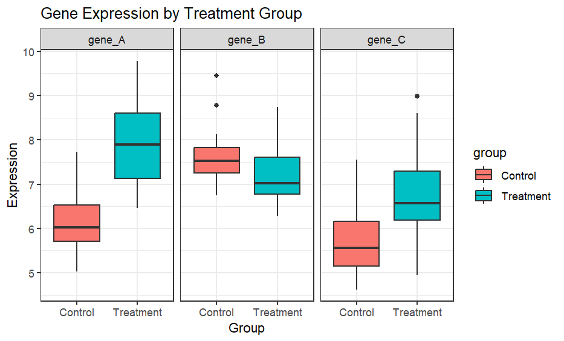
</p>

---

## 13.4 Faceted Violin Plots

```r
ggplot(expression_long, aes(x = group, y = expression, fill = group)) +
  geom_violin(alpha = 0.7) +
  geom_boxplot(width = 0.15, outlier.shape = NA) +
  facet_wrap(~ gene) +
  labs(
    title = "Distribution of Gene Expression by Group",
    x = "Group",
    y = "Expression"
  ) +
  theme_minimal()
```

---

# 14. Customizing Colors

ggplot2 automatically assigns colors, but we can manually customize them.

```r
ggplot(expression_data, aes(x = group, y = gene_A, fill = group)) +
  geom_boxplot(alpha = 0.7) +
  geom_jitter(width = 0.15, size = 2) +
  scale_fill_manual(
    values = c(
      "Control" = "skyblue",
      "Treatment" = "tomato"
    )
  ) +
  labs(
    title = "Gene A Expression by Group",
    x = "Group",
    y = "Gene A Expression"
  ) +
  theme_classic()
```

---

# 15. Customizing Themes

Themes control the overall appearance of plots.

Common themes include:

- `theme_gray()`
- `theme_bw()`
- `theme_classic()`
- `theme_minimal()`
- `theme_void()`

---

## 15.1 Default Theme

```r
ggplot(expression_data, aes(x = group, y = gene_A, fill = group)) +
  geom_boxplot()
```

---

## 15.2 Minimal Theme

```r
ggplot(expression_data, aes(x = group, y = gene_A, fill = group)) +
  geom_boxplot() +
  theme_minimal()
```

---

## 15.3 Classic Theme

```r
ggplot(expression_data, aes(x = group, y = gene_A, fill = group)) +
  geom_boxplot() +
  theme_classic()
```

---

## 15.4 Black and White Theme

```r
ggplot(expression_data, aes(x = group, y = gene_A, fill = group)) +
  geom_boxplot() +
  theme_bw()
```

---

# 16. Editing Text Size and Axis Labels

```r
ggplot(expression_data, aes(x = group, y = gene_A, fill = group)) +
  geom_boxplot() +
  labs(
    title = "Gene A Expression by Group",
    x = "Group",
    y = "Gene A Expression"
  ) +
  theme_classic() +
  theme(
    plot.title = element_text(size = 16, face = "bold"),
    axis.title = element_text(size = 14),
    axis.text = element_text(size = 12),
    legend.position = "none"
  )
```

---

# 17. Rotating Axis Text

This is useful when category names are long.

```r
ggplot(expression_long, aes(x = gene, y = expression, fill = gene)) +
  geom_boxplot() +
  theme_classic() +
  theme(
    axis.text.x = element_text(angle = 45, hjust = 1)
  )
```

---

# 18. Changing Legend Position

```r
ggplot(expression_long, aes(x = gene, y = expression, fill = group)) +
  geom_boxplot() +
  theme_classic() +
  theme(
    legend.position = "top"
  )
```

Other options include:

```r
theme(legend.position = "bottom")
theme(legend.position = "left")
theme(legend.position = "right")
theme(legend.position = "none")
```

---

# 19. Faceting

Faceting allows you to split a plot into multiple panels.

---

## 19.1 Facet by Gene

```r
ggplot(expression_long, aes(x = group, y = expression, fill = group)) +
  geom_boxplot() +
  facet_wrap(~ gene) +
  theme_classic()
```

---

## 19.2 Facet by Sex

```r
ggplot(expression_long, aes(x = group, y = expression, fill = group)) +
  geom_boxplot() +
  facet_wrap(~ sex) +
  labs(
    title = "Gene Expression by Group and Sex",
    x = "Group",
    y = "Expression"
  ) +
  theme_bw()
```

---

## 19.3 Facet by Gene and Sex

```r
ggplot(expression_long, aes(x = group, y = expression, fill = group)) +
  geom_boxplot() +
  facet_grid(sex ~ gene) +
  labs(
    title = "Gene Expression by Group, Sex, and Gene",
    x = "Group",
    y = "Expression"
  ) +
  theme_bw()
```

---

# 20. Coordinate Systems

## 20.1 Flip Coordinates

This is useful for long category names.

```r
ggplot(expression_long, aes(x = gene, y = expression, fill = gene)) +
  geom_boxplot() +
  coord_flip() +
  theme_classic()
```

---

## 20.2 Set Y-Axis Limits

```r
ggplot(expression_data, aes(x = group, y = gene_A, fill = group)) +
  geom_boxplot() +
  ylim(4, 10) +
  theme_classic()
```

A better option is often `coord_cartesian()` because it zooms without removing data.

```r
ggplot(expression_data, aes(x = group, y = gene_A, fill = group)) +
  geom_boxplot() +
  coord_cartesian(ylim = c(4, 10)) +
  theme_classic()
```

---

# 21. Adding Statistical Summaries

## 21.1 Add Mean Point

```r
ggplot(expression_data, aes(x = group, y = gene_A, fill = group)) +
  geom_boxplot(alpha = 0.7) +
  stat_summary(
    fun = mean,
    geom = "point",
    shape = 23,
    size = 3,
    fill = "white"
  ) +
  theme_classic()
```
<p align="center">
  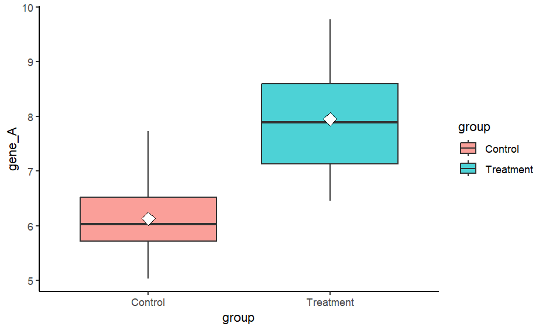
</p>

---

## 21.2 Add Mean and Confidence Interval

```r
ggplot(expression_data, aes(x = group, y = gene_A, color = group)) +
  stat_summary(
    fun = mean,
    geom = "point",
    size = 4
  ) +
  stat_summary(
    fun.data = mean_cl_normal,
    geom = "errorbar",
    width = 0.2
  ) +
  labs(
    title = "Mean Gene A Expression with Confidence Interval",
    x = "Group",
    y = "Gene A Expression"
  ) +
  theme_classic()
```
<p align="center">
  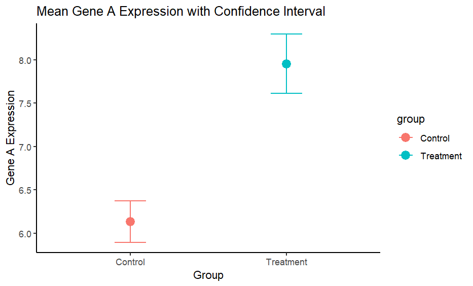
</p>

---


# 22. Combining Multiple Plots

The `patchwork` package can combine multiple ggplot2 plots.

```r
plot1 <- ggplot(expression_data, aes(x = group, y = gene_A, fill = group)) +
  geom_boxplot() +
  labs(title = "Gene A") +
  theme_classic()

plot2 <- ggplot(expression_data, aes(x = group, y = gene_B, fill = group)) +
  geom_boxplot() +
  labs(title = "Gene B") +
  theme_classic()

plot3 <- ggplot(expression_data, aes(x = group, y = gene_C, fill = group)) +
  geom_boxplot() +
  labs(title = "Gene C") +
  theme_classic()

plot1 + plot2 + plot3
```
<p align="center">
  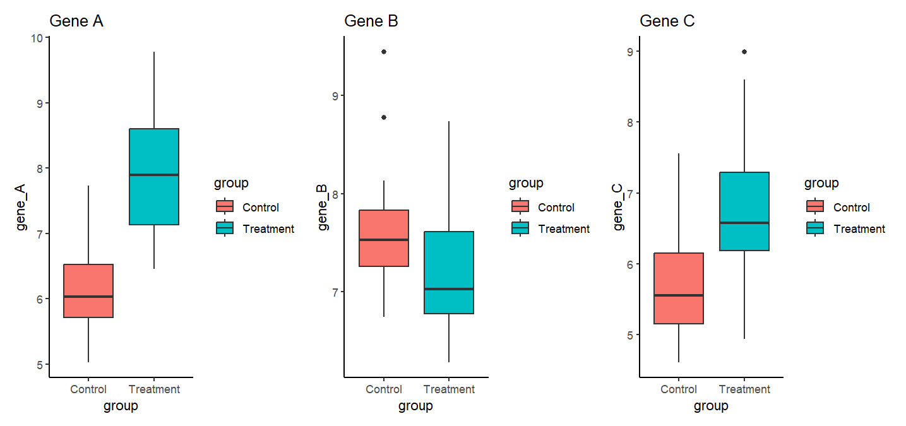
</p>

---

## 25.1 Arrange Plots in Multiple Rows

```r
(plot1 + plot2) / plot3
```

---

# 26. Saving Plots

You can save plots using `ggsave()`.

---

## 26.1 Save the Last Plot

```r
ggsave(
  filename = "gene_expression_plot.png",
  width = 8,
  height = 6,
  dpi = 300
)
```

---

## 26.2 Save a Specific Plot

```r
gene_A_plot <- ggplot(expression_data, aes(x = group, y = gene_A, fill = group)) +
  geom_boxplot(alpha = 0.7) +
  geom_jitter(width = 0.15, size = 2) +
  labs(
    title = "Gene A Expression by Group",
    x = "Group",
    y = "Gene A Expression"
  ) +
  theme_classic()

ggsave(
  filename = "gene_A_expression_boxplot.png",
  plot = gene_A_plot,
  width = 7,
  height = 5,
  dpi = 300
)
```

---

## 26.3 Save as PDF

```r
ggsave(
  filename = "gene_A_expression_boxplot.pdf",
  plot = gene_A_plot,
  width = 7,
  height = 5
)
```

---

# 27. Exporting Plots to a Folder

It is good practice to save plots in a specific folder.

```r
dir.create("results", showWarnings = FALSE)
dir.create("results/figures", showWarnings = FALSE)
```

```r
ggsave(
  filename = "results/figures/gene_A_expression_boxplot.png",
  plot = gene_A_plot,
  width = 7,
  height = 5,
  dpi = 300
)
```

---

# 28. Common ggplot2 Geoms

| Function | Plot Type |
|---|---|
| `geom_point()` | Scatter plot |
| `geom_line()` | Line plot |
| `geom_col()` | Bar plot using actual values |
| `geom_bar()` | Bar plot counting observations |
| `geom_boxplot()` | Boxplot |
| `geom_violin()` | Violin plot |
| `geom_histogram()` | Histogram |
| `geom_density()` | Density plot |
| `geom_tile()` | Heatmap-style plot |
| `geom_smooth()` | Trend line or regression line |
| `geom_jitter()` | Jittered points |

---

# 29. Common ggplot2 Theme Functions

| Function | Description |
|---|---|
| `theme_gray()` | Default ggplot2 theme |
| `theme_bw()` | Black and white theme |
| `theme_classic()` | Classic theme with axis lines |
| `theme_minimal()` | Minimal clean theme |
| `theme_void()` | Empty theme |

---

# 30. Common ggplot2 Customization Functions

| Function | Purpose |
|---|---|
| `labs()` | Add title, subtitle, axis labels, and legend labels |
| `theme()` | Customize text, legend, margins, and appearance |
| `scale_color_manual()` | Manually set point or line colors |
| `scale_fill_manual()` | Manually set fill colors |
| `facet_wrap()` | Create panels by one variable |
| `facet_grid()` | Create panels by two variables |
| `coord_flip()` | Flip x and y axes |
| `coord_cartesian()` | Zoom into plot area |
| `ggsave()` | Save plots |

---

# 31. Complete Practice Exercise

In this exercise, we will create a complete visualization workflow.

---

## 31.1 Prepare the Data

```r
practice_data <- expression_data %>%
  select(sample_id, group, sex, age, gene_A, gene_B, gene_C, clinical_score)

head(practice_data)
```

---

## 31.2 Convert to Long Format

```r
practice_long <- practice_data %>%
  pivot_longer(
    cols = c(gene_A, gene_B, gene_C),
    names_to = "gene",
    values_to = "expression"
  )

head(practice_long)
```

---

## 31.3 Create Summary Table

```r
practice_summary <- practice_long %>%
  group_by(group, gene) %>%
  summarise(
    mean_expression = mean(expression),
    sd_expression = sd(expression),
    n = n(),
    se_expression = sd_expression / sqrt(n),
    .groups = "drop"
  )

practice_summary
```

---

## 31.4 Plot Mean Expression

```r
ggplot(practice_summary, aes(x = gene, y = mean_expression, fill = group)) +
  geom_col(position = position_dodge(width = 0.8), width = 0.7) +
  geom_errorbar(
    aes(
      ymin = mean_expression - se_expression,
      ymax = mean_expression + se_expression
    ),
    position = position_dodge(width = 0.8),
    width = 0.2
  ) +
  labs(
    title = "Mean Gene Expression by Group",
    x = "Gene",
    y = "Mean Expression",
    fill = "Group"
  ) +
  theme_classic()
```

---

## 31.5 Plot Individual Data Points

```r
ggplot(practice_long, aes(x = gene, y = expression, color = group)) +
  geom_jitter(
    position = position_jitterdodge(
      jitter.width = 0.15,
      dodge.width = 0.8
    ),
    size = 2,
    alpha = 0.8
  ) +
  labs(
    title = "Individual Gene Expression Values",
    x = "Gene",
    y = "Expression",
    color = "Group"
  ) +
  theme_bw()
```

---

## 31.6 Final Publication-Style Plot

```r
final_plot <- ggplot(practice_long, aes(x = gene, y = expression, fill = group)) +
  geom_boxplot(
    position = position_dodge(width = 0.8),
    alpha = 0.7,
    outlier.shape = NA
  ) +
  geom_jitter(
    aes(color = group),
    position = position_jitterdodge(
      jitter.width = 0.15,
      dodge.width = 0.8
    ),
    size = 1.8,
    alpha = 0.7
  ) +
  labs(
    title = "Gene Expression Profiles by Treatment Group",
    subtitle = "Simulated biomedical expression dataset",
    x = "Gene",
    y = "Expression Level",
    fill = "Group",
    color = "Group"
  ) +
  theme_classic() +
  theme(
    plot.title = element_text(size = 16, face = "bold"),
    plot.subtitle = element_text(size = 12),
    axis.title = element_text(size = 13),
    axis.text = element_text(size = 11),
    legend.position = "top"
  )

final_plot
```

---

## 31.7 Save the Final Plot

```r
dir.create("results", showWarnings = FALSE)
dir.create("results/figures", showWarnings = FALSE)

ggsave(
  filename = "results/figures/final_gene_expression_plot.png",
  plot = final_plot,
  width = 9,
  height = 6,
  dpi = 300
)
```

---

# 32. Common Mistakes and How to Fix Them

## 32.1 Forgetting the Plus Sign

Incorrect:

```r
ggplot(expression_data, aes(x = group, y = gene_A))
  geom_boxplot()
```

Correct:

```r
ggplot(expression_data, aes(x = group, y = gene_A)) +
  geom_boxplot()
```

---

## 32.2 Putting `aes()` in the Wrong Place

This works:

```r
ggplot(expression_data, aes(x = group, y = gene_A, fill = group)) +
  geom_boxplot()
```

This also works:

```r
ggplot(expression_data, aes(x = group, y = gene_A)) +
  geom_boxplot(aes(fill = group))
```

But this is usually clearer:

```r
ggplot(expression_data, aes(x = group, y = gene_A, fill = group)) +
  geom_boxplot()
```

---

## 32.3 Using `geom_bar()` Instead of `geom_col()`

Use `geom_bar()` when you want to count observations.

```r
ggplot(expression_data, aes(x = group)) +
  geom_bar()
```

Use `geom_col()` when you already have summarized values.

```r
ggplot(gene_summary, aes(x = group, y = mean_gene_A)) +
  geom_col()
```

---

## 32.4 Axis Labels Are Missing

Use `labs()` to add labels.

```r
ggplot(expression_data, aes(x = group, y = gene_A)) +
  geom_boxplot() +
  labs(
    title = "Gene A Expression",
    x = "Group",
    y = "Expression"
  )
```

---

# 33. Mini Quiz

## Question 1

Which function is used to create a scatter plot?

```r
geom_point()
```

---

## Question 2

Which function is used to create a boxplot?

```r
geom_boxplot()
```

---

## Question 3

Which function is used to split a plot into panels?

```r
facet_wrap()
```

or

```r
facet_grid()
```

---

## Question 4

Which function is used to save a plot?

```r
ggsave()
```

---

# 34. Summary

In this tutorial, you learned how to:

- Create plots using `ggplot2`
- Use `aes()` to map variables to plot features
- Create scatter plots, boxplots, violin plots, histograms, density plots, bar plots, and line plots
- Visualize biomedical gene expression data
- Create volcano plots and PCA plots
- Customize labels, colors, legends, and themes
- Combine plots using `patchwork`
- Save plots using `ggsave()`

---

